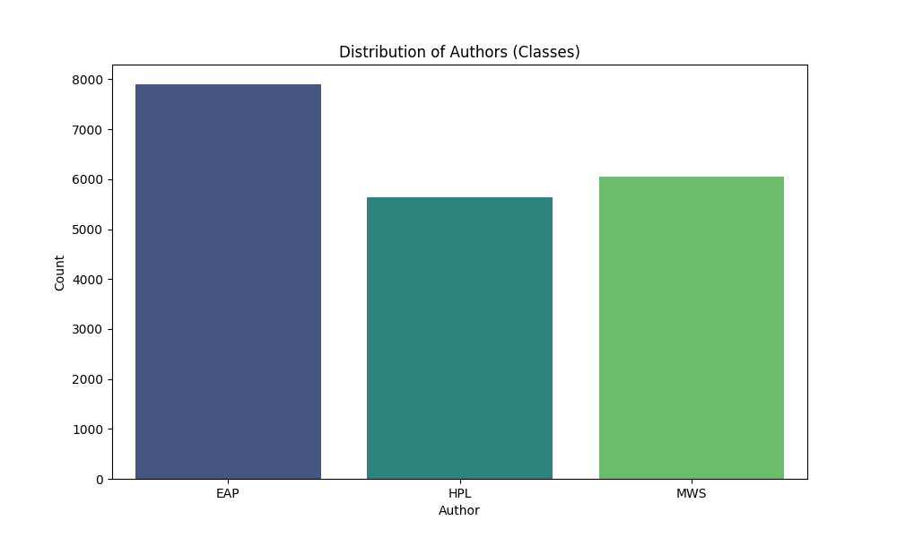
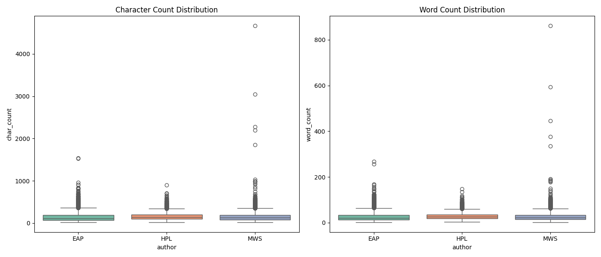
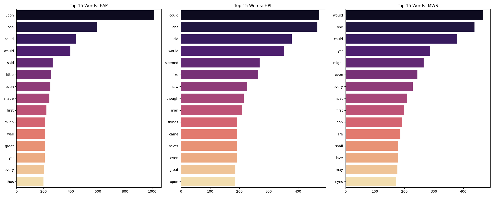
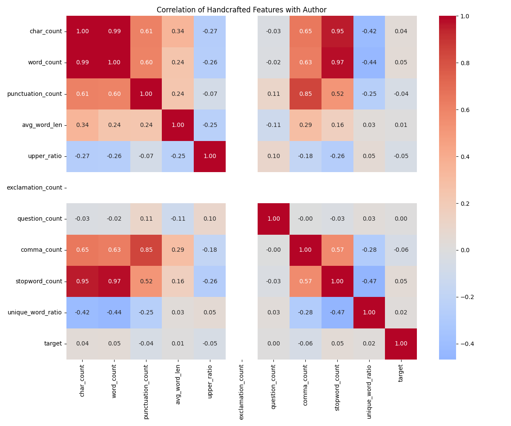
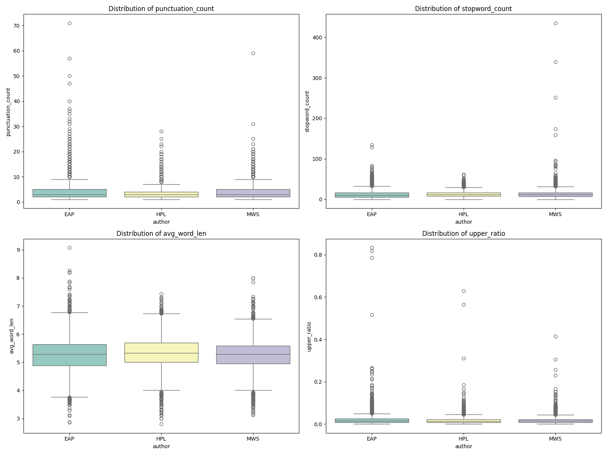

# Research Report: Spooky Author Identification

## 1. Исследовательский анализ данных (EDA)
Датасет [Spooky Author Identification](https://www.kaggle.com/competitions/spooky-author-identification/data) представляет собой задачу индификации авторства на примере 3 авторов в жанре хоррор (Эдгар Алан По, Мэрри Шелии и Говард Лавкрафт). Задача ставится как задача классификации предложений. Изначальной метрикой соревнования является LogLoss, но также добавим метрики Accuracy и F1-Macro.

## Сетап

* **CPU:** Intel Ultra 7 265K
* **GPU** Nvidia H200 141Gb

### 1.1 Анализ целевой переменной
*   **Классы:** EAP (Edgar Allan Poe), HPL (HP Lovecraft), MWS (Mary Shelley).
*   **Распределение:** EAP (40.35%), MWS (30.87%), HPL (28.78%).

*   **Вывод:** Наблюдается небольшой дисбаланс. При валидации необходимо использовать `StratifiedKFold`.

### 1.2 Признаки и статистики
*   **Тексты:** Стиль авторов незначительно различается. HPL использует наиболее длинные и сложные предложения, EAP — более лаконичные.



*   **Стилометрия:** Топ-слова (без стоп-слов) в целом долвьлно типичные и не дают какой-то значительной информации.




*   **Ручные признаки:** Т.к. лексика может быть довольно типичной и не дать на TFIDF достаточно информации, добавим числовые статистические признаки, они могут дать информацию о стилистике авторов.

    *   Проведен анализ корреляций и распределений для 10+ признаков (длина слов, количество знаков препинания, доля стоп-слов и др.). 
    *   Выявлено, что `avg_word_len` и `punctuation_count` имеют заметную корреляцию с определенными авторами.

    

    *   HPL выделяется специфическим использованием знаков препинания и более сложной структурой слов.

    
---

## 2. Сравнительный анализ моделей (Метрики)

Для оценки качества использовались: **Accuracy** (доля правильных ответов) и **Macro F1-score** (среднее гармоническое полноты и точности, устойчивое к балансу классов).

### 2.1 Итоговая таблица результатов

| Модель | Accuracy | F1-Macro | LogLoss
|:---|:---:|:---:|:---|
| LAMA (TF-IDF) | 76.53% | 75.98% | 0.5886 
| LAMA (TF-IDF + Stat) | <ins>80.98%</ins> | <ins>80.86%</ins> | <ins>0.4847</ins> 
| Custom XGBoost + LSA | 68.17% | 67.69% | 0.7353 
| E5-multilingual-base| **84.98%** | **84.85%** | **0.4008**

---

## 3. Обоснование выбора архитектур

### 3.1 LAMA (TF-IDF и TF-IDF + stats)
*  **Гипотеза**: Baseline.  Используем векторизацию TF-IDF (n-gramms n=1...3) и данные о статистиках текста. Проверим, что статистики дают прирост
*  **Результат:** Точность составила 76% для чистого TF-IDF и 80% для TF-IDF + статистики. Гипотеза подтвердилась.


### 3.2 XGBoost + LSA (Custom Pipeline)
*   **Гипотеза:** Снижение размерности через TruncatedSVD (Latent Semantic Analysis) поможет древовидным моделям уловить скрытые семантические связи, которые теряются в разреженных матрицах TF-IDF.
*   **Результат:** Гипотеза не подтвердилась. Точность составила всего 68%. Это указывает на то, что для классификации авторского стиля "разреженные" частотные признаки (конкретные слова и их n-граммы) несут больше информации, чем их плотные низкоразмерные проекции.

### 3.3 E5-multilingual-base (Fine-Tuning)
*   **Гипотеза:** Семантическое понимание текста с учетом дообучения будет эффективнее статитистик. 
*   **Результат:** Прирост точности на 4% относительно LAMA и на 16% относительно XGBoost. Трансформер значительно превосходит статистические методы, хотя очевидно проигрывает в продолжительности подготовки модели LAMA (3.5 минуты на CPU VS 9 минут GPU) и цене инференса

---

## 4. Инструкции по запуску

Для воспроизведения результатов используйте следующие команды:

### 4.1 Подготовка и EDA
```bash
# Установка зависимостей (используя UV)
uv sync

# Запуск исследовательского анализа данных
uv run main_eda.py
```

### 4.2 Обучение моделей
```bash
# Обучение бейзлайна на LightAutoML
uv run train_lama.py

# Обучение кастомного пайплайна (XGBoost + LSA)
uv run train_custom.py

# Fine-tuning трансформера (E5) - требует GPU
uv run train_hf.py
```

### 4.3 Финальные шаги
```bash
# Запуск блендинга предсказаний
uv run run_blending.py

# Расчет всех итоговых метрик
uv run calculate_all_metrics.py
```

---

## 5. Итоги

LAMA является отличным инструментом для получения дешевого инференса и быстро обучается, хотя и проигрывает в качестве transformer-based методам. Тем не менее "ручными" методами сопостовимых масштабов и цены инференса ее побить не удалось.